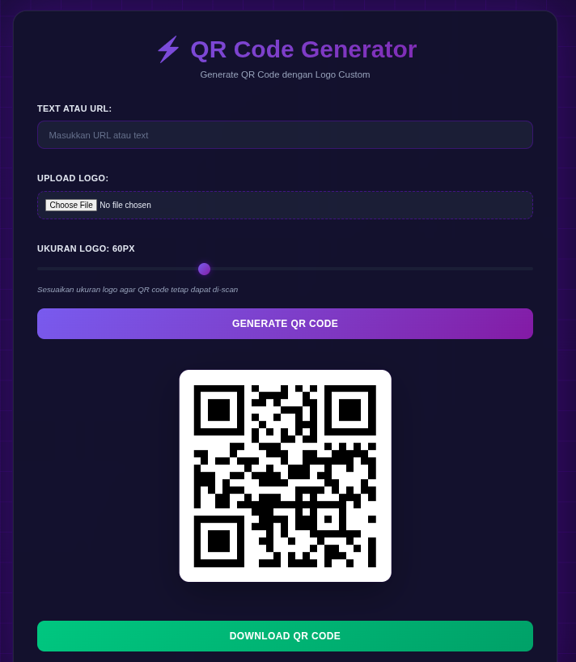

# QR Code Generator dengan Logo

Generator QR Code interaktif yang memungkinkan Anda membuat QR code dengan logo custom di tengahnya.

## Fitur

- ✨ Generate QR Code dari text atau URL
- 🖼️ Tambahkan logo custom di tengah QR code
- 🎚️ Sesuaikan ukuran logo dengan slider
- 💾 Download QR code sebagai gambar PNG
- 🎨 Desain modern dengan tema gelap
- 📱 Responsive untuk semua ukuran layar

## Cara Menggunakan

### 1. Persiapan File

Simpan kode HTML di atas sebagai file dengan nama `qr-generator.html`

### 2. Membuka Aplikasi

Ada beberapa cara untuk membuka file HTML:

**Cara 1: Double-click file**
- Cukup double-click file `qr-generator.html`
- File akan terbuka otomatis di browser default Anda

**Cara 2: Buka melalui browser**
- Buka browser (Chrome, Firefox, Edge, dll)
- Tekan `Ctrl + O` (Windows/Linux) atau `Cmd + O` (Mac)
- Pilih file `qr-generator.html`

**Cara 3: Drag and drop**
- Buka browser Anda
- Drag file `qr-generator.html` ke jendela browser

### 3. Menampilkan Gambar/Logo

Untuk menampilkan logo di QR code:

1. **Siapkan file gambar logo** (format: JPG, PNG, GIF, dll)
2. **Klik tombol "Choose File"** di bagian "Upload Logo"
3. **Pilih file gambar** dari komputer Anda
4. **Logo akan otomatis muncul** di tengah QR code
5. **Sesuaikan ukuran logo** menggunakan slider "Ukuran Logo"

**Tips untuk Logo:**
- Gunakan gambar dengan latar belakang transparan (PNG) untuk hasil terbaik
- Ukuran logo yang terlalu besar bisa membuat QR code sulit di-scan
- Ukuran optimal: 50-80px
- Format yang didukung: JPG, PNG, GIF, WebP, SVG

### 4. Generate QR Code

1. Masukkan URL atau text di field "Text atau URL"
2. Upload logo (opsional)
3. Sesuaikan ukuran logo jika perlu
4. Klik tombol **"Generate QR Code"**
5. QR code akan muncul di tengah halaman

### 5. Download QR Code

Klik tombol **"Download QR Code"** untuk menyimpan QR code sebagai file PNG ke komputer Anda.

## Troubleshooting

### Logo tidak muncul?
- Pastikan file gambar valid dan tidak corrupt
- Coba gunakan format PNG atau JPG
- Ukuran file tidak terlalu besar (maksimal 5MB)

### QR Code tidak bisa di-scan?
- Perkecil ukuran logo menggunakan slider
- Logo yang terlalu besar menutupi terlalu banyak data QR code
- Pastikan ada kontras yang cukup antara QR code dan logo

### File HTML tidak terbuka?
- Pastikan file tersimpan dengan ekstensi `.html`
- Coba buka dengan browser yang berbeda
- Check apakah browser Anda up-to-date

## Teknologi yang Digunakan

- HTML5
- CSS3 (dengan Gradient & Backdrop Filter)
- JavaScript (Vanilla)
- QRCode.js library dari CDN

## Browser yang Didukung

- ✅ Google Chrome (Recommended)
- ✅ Mozilla Firefox
- ✅ Microsoft Edge
- ✅ Safari
- ✅ Opera

## Catatan Keamanan

- Semua proses dilakukan di browser (client-side)
- Tidak ada data yang dikirim ke server
- Aman untuk generate QR code dengan data sensitif
- File gambar logo hanya diproses secara lokal

## Lisensi

Free to use untuk keperluan personal dan komersial.

---

**Dibuat dengan ❤️ menggunakan HTML, CSS, dan JavaScript**